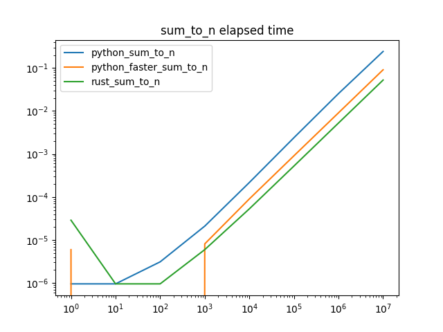
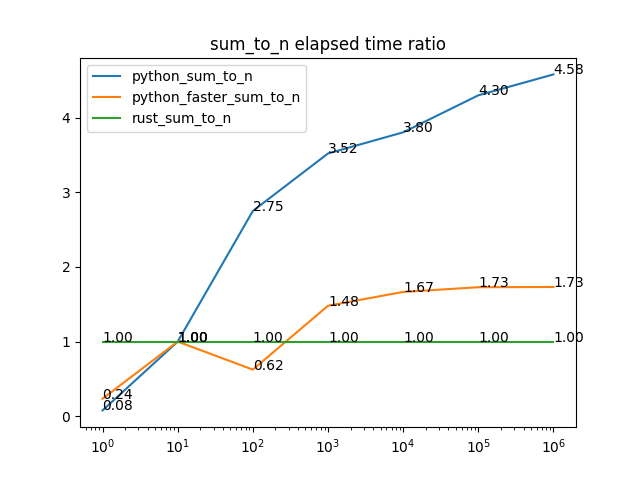

# python_rust_module
## description
This is a sample project to compare the performance of python and rust binding.


## prerequisuite
poetry
python3.11
rust

## setup
```shell
poetry install # install python dependencies
mnaturin develop # build & link rust module
```

## run
```shell
python -m python_rust_module.main
```

## result



